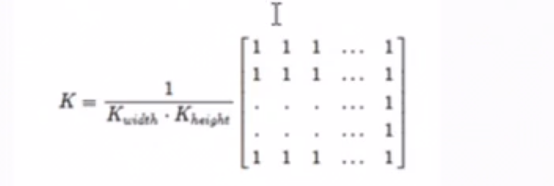

## 图片模糊

  具体代码位置:[cv_blur.cpp](../app/src/main/cpp/effects/blur/cv_blur.cpp)

### 基本知识

  Smooth/Blur是图像中最简单的和常用的操作之一，使用该操作的原因之一是为了给图像预处理时降低噪点，其背后就是数学的卷积计算。通常这些卷积算子计算都是线性操作，所以又叫线性滤波。下面是均值滤波过错：


  假如有6x6的图像像素点矩阵。
  卷积过程：6x6上面是个3x3的窗口,从左到右，从上向下移动，黄色的每个像素点值之和取平均值赋给中心红色像素作为它卷积处理之后的新的像素值。每次平移一个像素格。在处理完成一行后，向下移动处理第二行。如果用
3x3的矩阵，边缘像素第一行第一列和最后一行最后一列并不能进行卷积。

#### 模糊原理

 - 归一化和值滤波(均值滤波)


 - 高斯滤波


### OpenCv中的点和颜色

#### cv::Point

  Point表示2D平面上一个点x,y

```c++
  Point p1;
  p1.x = 10;
  p1.y = 20;

  p1 = Point(10,8);
```
#### cv::Scalar

  Scalar表示四个元素的向量，灰色图像可以只声明一个。

```c++
  Scalar(a,b,c);
```
  BGR 3通道时，a为blue,b为green,c为red 。

###

### 在OpenCv中的API

#### 均值模糊

```c++
void blur( InputArray src, OutputArray dst,Size ksize, Point anchor = Point(-1,-1),int borderType = BORDER_DEFAULT );
```
 - src :原图像 ;
 - dst :输出图像 ;
 - ksize :窗口的大小 ;
 - anchor : 中心像素 ;

#### 高斯模糊

```c++
void GaussianBlur( InputArray src, OutputArray dst, Size ksize,double sigmaX, double sigmaY = 0,int borderType = BORDER_DEFAULT );
```
 - src :原图像 ;
 - dst :输出图像 ;
 - ksize :窗口的大小,其中的 x,y必须为正数奇数 ;
 - sigmaX :X方向上的高斯核标准偏差。
 - sigmaY :Y方向上的高斯核标准偏差。

### 中值滤波

  中值滤波是统计排序滤波器，中值对噪点有很好的抑制作用。


  在3x3的矩阵中，我们对其进行排序，然后将中间值150替换为排序后的中位值124然后再求平均值，然后继续向后移动。如果我们将150替换为排序后的最大值或最小值，就叫做最小值滤波和最大值滤波。

```c++
void medianBlur( InputArray src, OutputArray dst, int ksize );
```
 - src :原图像 ;
 - dst :输出图像 ;
 - ksize :窗口的大小，必须大于1且为奇数 ;

### 双边滤波

  均值模糊无法克服边缘像素信息丢失缺陷，原因是均值滤波是基于平均权重。高斯模糊部分克服了该缺陷，但是无法完全避免，因为没有考虑像素值的不同。
高斯双边模糊-是边缘保留的滤波方法，避免了边缘信息的丢失，保留了图像轮廓不变。

> 注意：仅仅支持单通道和三通道图片 ;

```c++
void bilateralFilter( InputArray src, OutputArray dst, int d,double sigmaColor, double sigmaSpace,int borderType = BORDER_DEFAULT );
```
 - src :原图像 ;
 - dst :输出图像 ;
 - d :计算的半径,半径之内的像素都会被纳入计算，如果提供-1则根据sigmaSpace参数取值 ;
 - sigmaColor : 决定多少差值之内的像素会被计算 ;
 - sigmaSpace : 如果d的值大于0则声明无效，否则根据它的值来计算d值

### 整体效果


