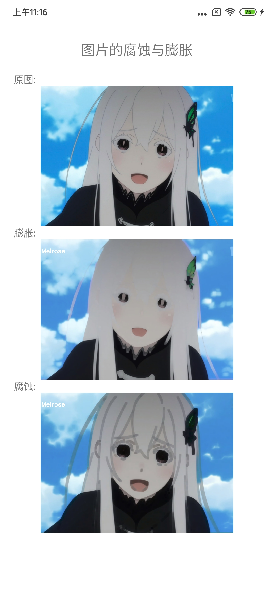

## 图像的腐蚀与膨胀

 图像形态学操作是基于形状的一系列图像处理操作的合集，主要是基于集合论基础上的形态学数学。形态学有四个基本操作：腐蚀、膨胀、开、闭。膨胀与腐蚀是图像处理中最常用的形态学操作手段。具体代码位置:[cv_blur.cpp](../app/src/main/cpp/effects/swell/cv_swell.cpp)

### 形态学操作 - 膨胀

 跟卷积操作类似，假设有图像A和结构元素B，结构元素B在A上面移动，其中B定义其中心为锚点，计算B覆盖下A的最大像素值来替换锚点的像素，其中B作为结构元素可以是任意形状。用最大值像素来替换锚点所以整体都会偏向白色。比如一张灰度图像中有很多白点，用膨胀就会将这些白点就会变大。

### 形态学操作 - 腐蚀

 腐蚀跟膨胀操作过程类似，唯一不同的是以最小值替换锚点重叠下图像的像素值,结构元素越大所以整体会偏向黑色。比如一张灰度图像中有很多白点，用腐蚀就会将这些白点转黑去除。


### OpenCV中的API

#### 生成结构元素API
  如果需要调整腐蚀和膨胀的程度只需要调整结构元素的ksize即可，

```c++
   Mat getStructuringElement(int shape, Size ksize, Point anchor = Point(-1,-1));
```
 - shape : MORPH_RECT 、 MORPH_CROSS、MORPH_ELLIPSE ：分别是矩形结构元素、十字形结构元素和椭圆结构元素。
 - ksize : 结构元素的大小,需为奇数 ;
 - anchor : 锚点，即中心像素 ;

 #### 膨胀的API

 ```c++
 void dilate( InputArray src, OutputArray dst, InputArray kernel,
                           Point anchor = Point(-1,-1), int iterations = 1,
                           int borderType = BORDER_CONSTANT,
                           const Scalar& borderValue = morphologyDefaultBorderValue() );
 ```
  - src : 输入图像 ;
  - dst : 输出图像 ;
  - kernel :用于扩张的结构元素； 如果elemenat = Mat（），则为3 x 3的矩形 。 可以使用getStructuringElement函数创建kernel ;
  - anchor : 锚在元素内的位置； 默认值（-1，-1）表示锚点位于元素中心 ;
  - borderType : 像素外推方法，请见#BorderTypes。 不支持#BORDER_WRAP ;
  - borderValue : 边界不变时的边界值 ;

#### 腐蚀的API

 ```c++
 void erode( InputArray src, OutputArray dst, InputArray kernel,
                          Point anchor = Point(-1,-1), int iterations = 1,
                          int borderType = BORDER_CONSTANT,
                          const Scalar& borderValue = morphologyDefaultBorderValue() );
 ```
  - src : 输入图像 ;
  - dst : 输出图像 ;
  - kernel :用于腐蚀的结构元素； 如果elemenat = Mat（），则为3 x 3的矩形 。 可以使用getStructuringElement函数创建kernel ;
  - anchor : 锚在元素内的位置； 默认值（-1，-1）表示锚点位于元素中心 ;
  - iterations : 侵蚀次数 ;
  - borderType : 像素外推方法，请见#BorderTypes。 不支持#BORDER_WRAP ;
  - borderValue : 边界不变时的边界值 ;

### 膨胀和腐蚀的用法

 在进行图像处理时，用腐蚀去过滤掉小的对象保留大的对象。消除小的噪声块，可以先对图像进行腐蚀。当然这些要根据前景和背景来决定你使用膨胀还是腐蚀，比如如果背景是白色，使用膨胀，前景黑色就会变小。


### 整体效果



