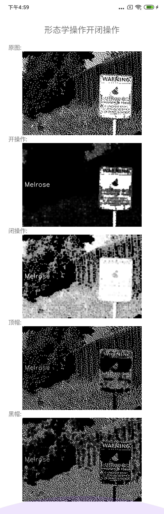

## 形态学操作
图像形态学操作是基于形状的一系列图像处理操作的合集，主要是基于集合论基础上的形态学数学。形态学有四个基本操作：腐蚀、膨胀、开、闭。具体代码位置:[cv_open.cpp](../app/src/main/cpp/effects/open/cv_open.cpp)

### 形态学操作 - 开操作

 开操作就是先腐蚀后膨胀，可以先去掉小的对象，假设对象白色是前景色，背景是黑色，前景有很多小白点，开操作就可以去掉白色的小点。

### 形态学操作 - 闭操作

 闭操作就是膨胀后腐蚀，可以先填充小的对象，假设对象白色是前景色，背景是黑色，前景有很多小黑点，闭操作就可以填充黑色的小点。

### 形态学操作 - 形态学梯度
 
 膨胀减去腐蚀，又称为基本梯度。
 
 
### 形态学操作 - 顶帽
 
 原图像和开操作之间的差值图像，即前景会留下开操作中去掉的小白点(输入图像必须为3通道图像)。
 
### 形态学操作 - 黑帽
 
 原图像和闭操作之间的差值图像，即前景会留下闭操作中填充的小黑点(输入图像必须为3通道图像)。 
 
### OpenCV中的API

#### 生成结构元素API

 如果需要调整腐蚀和膨胀的程度只需要调整结构元素的ksize即可，

```c++
   Mat getStructuringElement(int shape, Size ksize, Point anchor = Point(-1,-1));
```
 - shape : MORPH_RECT 、 MORPH_CROSS、MORPH_ELLIPSE ：分别是矩形结构元素、十字形结构元素和椭圆结构元素。
 - ksize : 结构元素的大小,需为奇数 ;
 - anchor : 锚点，即中心像素 ;

 #### 形态学操作的API

```c++
   void morphologyEx( InputArray src, OutputArray dst,
                                   int op, InputArray kernel,
                                   Point anchor = Point(-1,-1), int iterations = 1,
                                   int borderType = BORDER_CONSTANT,
                                   const Scalar& borderValue = morphologyDefaultBorderValue() );
```
  - src : 输入图像 ;
  - dst : 输出图像 ;
  - op : 形态学运算的类型，枚举MorphTypes,MORPH_OPEN:开操作,MORPH_CLOSE:闭操作,MORPH_GRADIENT：形态学梯度,MORPH_TOPHAT:顶帽,MORPH_BLACKHAT:黑帽 ; 
  - kernel :结构元素；可以使用getStructuringElement函数创建kernel ;
  - anchor : 锚在元素内的位置； 默认值（-1，-1）表示锚点位于元素中心 ;
  - iterations : 执行腐蚀和膨胀的次数 ;
  - borderType : 像素外推方法，请见#BorderTypes。 不支持#BORDER_WRAP ;
  - borderValue : 边界不变时的边界值 ;


### 整体效果



