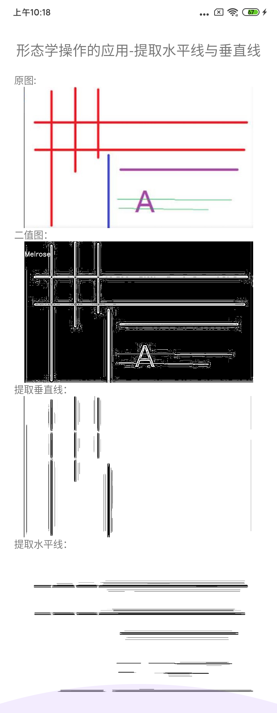

## 图像形态学操作的应用-提取水平线与垂直线
图像形态学操作的时候，可以通过自定义的结构元素实现结构元素对输入图像的一些对象敏感、另外一些对象不敏感，这样就会让敏感的对象改变而不敏感的对象保留
输出。通过使用两个最基本的形态学操作- 膨胀与腐蚀，使用不同的结构元素实现对输入图像的操作从而得到想要的结果。
- 膨胀：输出的像素值是结构元素覆盖下输入图像的最大像素值
- 腐蚀：输出的像素值是结构元素覆盖下输入图像的最小像素值
常见的结构元素的形状有矩形、圆、直线等各种元素。
### 步骤
- 将图像转为灰度图像 cvtColor
- 转换为二值图像 adaptiveThreshold
- 定义结构元素
- 开操作(腐蚀+膨胀)提取水平与垂直线
 
### 转换为二值图像

```c++
void adaptiveThreshold( InputArray src, OutputArray dst,
                                     double maxValue, int adaptiveMethod,
                                     int thresholdType, int blockSize, double C );
``` 
- src : 输入图像
- dst : 输出图像
- maxValue : 二值图像最大值 255
- adaptiveMethod : 自适应方法 ADAPTIVE_THRESH_MEAN_C或ADAPTIVE_THRESH_GAUSSIAN_C
- thresholdType : 阀值类型 THRESH_BINARY
- blockSize : 块大小 15 
- C : 常量 可以为正数、0、负数
 

### 代码实现
 下面为提取垂直线的部分代码，如果需要提取水平直线则将结构元素的高度设置为1就行了：
```c++
      Mat img,gray,binary,temp;
      bitmap2Mat(env,source,&img);
      cvtColor(img,gray,COLOR_RGBA2GRAY);
      adaptiveThreshold(~gray,binary,255,ADAPTIVE_THRESH_MEAN_C,THRESH_BINARY,15,0);
      //竖直的线
      auto vLine = getStructuringElement(MORPH_RECT,Size(1,binary.rows/16));
  
      //开操作
      erode(binary,temp,vLine);
      dilate(temp,temp,vLine);
  
      //将背景变为白色
      bitwise_not(temp,temp);
  
      putAuthorToMat(temp);
      return createBitmap(env,temp,config);
```


### 整体效果



